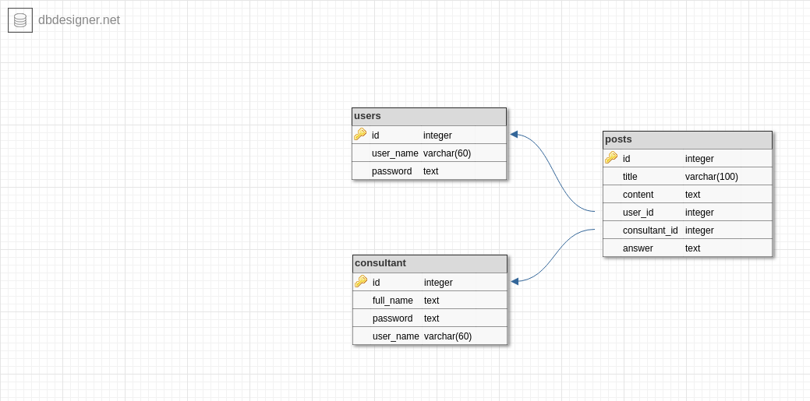

# Leannky-Anty
## Problem:
most of women rights get lost becuse they dont know their legal rights specially inheritance rights,also women cann't resort to legal consultant on the real life such as fair,or not has mony.

## Solution:
create a website to help shying and affraid woman ask about her legal rights by contacting legal consultant for free.

leannky Anty website serves this idea and make Gazian's woman aware of her legal rights.
## User Experience
### Woman
- as a woman i want to create new account by just typing username and password.
- as a woman i can login to my account smoothly.
- as a woman  i can post my question.
- as a woman i can view my previous questions with their answers if any.
- as a womman i can view other woman's questions with their answers if any .
### Consultant
- as a consultant i can login to my existing account smoothly.
- as a counsultant i can view new posted questions and try to answer them if i want to do that.
- as a consultant i can view my previous answers.

## Tecknology Used:
- html.
- css.
- express server.
- express-handlebars.
- postgres sql database.

## Database Schema

We also used figma website to design UI and UX [prototype](https://www.figma.com/file/Ccf3FqdidXR2o2YMmbKmOxh4/Leannky-Anty?node-id=0%3A1) and then make user experience to get real users feedback.

## How to use
- clone [rep](https://github.com/alaabadra/leannky-anty).
- cd leannky-Anty
- npm i
- create .env file and add SECRET and DATABASE_URL.
- type (npm run start).

